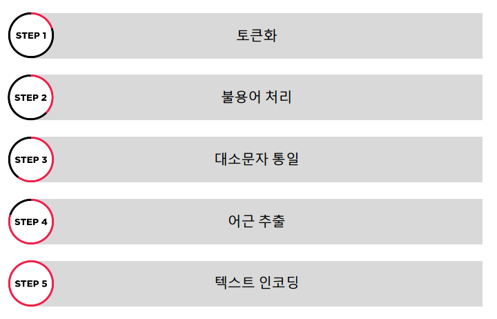

# 텍스트 전처리

### 정의

- 컴퓨터가 이해하지 못하는 텍스트의 특징을 알 수 있게 해주는 과정

### 과정

#### step 1 : 토큰화(Tokenization)

- 텍스트를 정해진 단위로 나누는 과정

#### step 2 : 불용어 처리(Stopword Removal)

- 쓸모없는 단어 지우는 과정

#### step 4 : 대소문자 통일(Capitalization)

- 대소문자를 통일시켜주는 과정
- 컴퓨터에서 Stop 과 stop은 다르다.
- 한국어에서는 쓰이지 않는다.

### step 5 : 어근 추출(Stemming & Lemmatization)

- 단어 표현 통일시키는 과정
- 어근 추출 방법에는 두가지가 있다.

1. lemmatization : 통일(어근)된 표현을 존재하는 표현으로 -> 신조어는 이 과정이 진행안됨.
2. stemming : 특정 알고리즘을 통해서 기계적으로 변환 -> 신조어도 진행됨

### step 6 : 텍스트 인코딩(Text Encoding)

- 텍스트를 벡터로 표현하는 과정
- 두 가지 방법
  - Vector Space Model
    - Bag-of-word(BOW)
    - Tern Frequenct - Inverse Document Frequenct(TF-IDF)
  - Word Embedding

